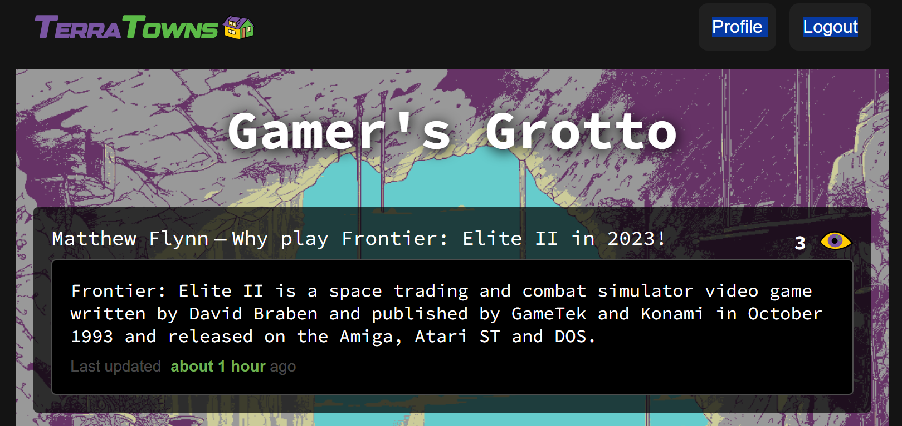
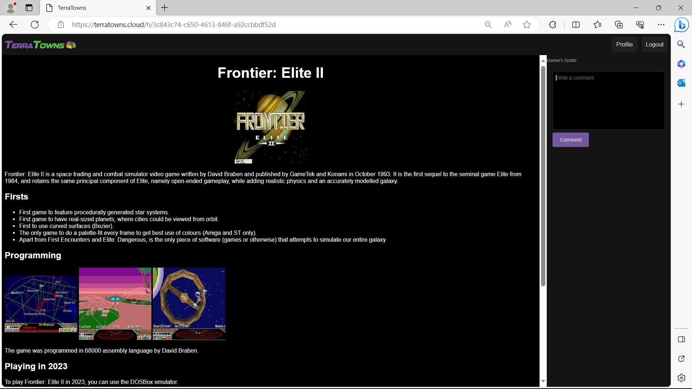

# <p align=center>Terraform Beginner Bootcamp 2023 Week 2

## Week 2 Objectives.
The objectives of week 2 where:
- Clone a [Sinatra](https://en.wikipedia.org/wiki/Sinatra_%28software%29) web server use as a mock TerraTowns server.
- Understand how a Sinatra mock server is coded using the Ruby programming language.
- Understand how gemfiles are used with Ruby applications.
- Understand how to execute a Ruby application.
- Understand CRUD and how it is related to Terraform custom providers.
- Clone bash scripts used for CRUD.
- Clone a Terraform custom provider into our repository.
- Understand how custom providers are coded using the Go programming language.
- Test the custom provider locally using the Sinatra web server.
- Test the custom provider locally using the CRUD bash scripts.
- Use the custom provider to create a 'Home' in [TerraTowns](https://terratowns.cloud/).
- Refactor project to better support creation of multiple 'Homes'.
- Use Terraform Cloud to store the state file.


<p align="center">

  

</p>

# <p align=center>Week 2 Architecture Diagram </p>

# Table of Contents

- [Sinatra](#sinatra)
  - [Running the mock server](#running-the-mock-server)
  - [Gitpod environment](#gitpod-environment)
- [TerraTowns](#terratowns)
  - [Terraform custom provider](#terraform-custom-provider)
  - [Custom provider build](#custom-provider-build)
- [External References](#external-references)


## Sinatra server
[Sinatra](https://sinatrarb.com/documentation.html) is a free and open source micro server framework written in Ruby.

We have been provided with the Ruby code for this server. It will act as a mock TerraTowns server and will be used for testing with our Terraform custom provider 'terratowns'.

We cloned the [code](https://github.com/ExamProCo/terratowns_mock_server) into this repository along with the Bash scripts for [Create Read Update Delete](https://en.wikipedia.org/wiki/Create,_read,_update_and_delete) (CRUD)

These bash scripts will be used to test all the endpoints of our TerraTowns custom provider using the mock server.

Create, Read, Update and Delete are the four actions required for all Terraform providers.

### Running the mock server
To run the mock server we will use the following commands in the bash terminal window.

```bash
cd terratowns_mock_server
bundle install
```

Command, **bundle install**, installs the gems specified in the Gemfile. The Gemfile is a file that lists the Ruby gems that your application needs.

Once the gems have been installed, you can run your Ruby application using the **bundle exec** command. This will ensure that your application is running with the correct dependencies installed.

```bash
cd terratowns_mock_server
bundle exec ruby server.rb
```
This will start the web server on port 4567. You can then access the web application at http://localhost:4567.

bundle install is a very useful tool for managing Ruby dependencies. It ensures that your applications are always running with the correct dependencies installed.

Here are some additional benefits of using bundle install:

- It keeps your application's dependencies consistent across different machines.
- It makes it easy to update your application's dependencies.
- It helps to prevent dependency conflicts.

Overall, bundle install is an essential tool for any Ruby developer.

### Gitpod environment
We updated the gitpod.yml file to automatically start the server when a Gitpod workspace is launched.

## TerraTowns
[TerraTowns](https://terratowns.cloud/) is a community website where bootcamp participants (terraformers) launch their own Terra Home (a user-created website) and connect their home to a Town for other Terraformers to view. This is similar to GeoCities circa 2001.

There are five towns to choose based on the topic of our static website theme.

#### TerraTowns Home page listing all the Towns
<p align="center">
  
</p>


### Terraform custom provider

Terraform supports a plugin model, and all providers are actually plugins. Plugins are distributed as Go binaries. Almost all Terraform plugins are written in Go.[<sup>[1]</sup>](#external-references)

For this project we have been provided with the code for the TerraTowns custom provider. We need to use the custom provider to interact with the target API of https://terratowns.cloud/api.

Normally a custom provider will be published to [registry.terraform.io](https://registry.terraform.io/browse/providers), but our custom provider will be stored with our Terraform project. This we limit us to using local [execution mode](https://developer.hashicorp.com/terraform/cloud-docs/workspaces/settings#execution-mode) when using Terraform Cloud.

We use this provider to create a 'Home' at a [TerraTowns](https://terratowns.cloud/) town. We will provide a name and description 
and the Amazon CloudFront domain name of our S3 stored static website. The website will be displayed in a iframe for our chosen town.

#### Static website link in Town Gamer's Grotto
<p align="center">
  
</p>

#### Static website displayed in iFrame
<p align="center">
  
</p>

### Custom provider build

To build our custom provider we were provided with a bash script 'build_provider'. 

The script works as follows:

- It sets the PLUGIN_DIR variable to the location where the Terraform provider will be installed.
- It sets the PLUGIN_NAME variable to the name of the Terraform provider.
- It changes folder to the terraform-provider-terratowns folder.
- It copies the terraformrc file from the project root folder to the Gitpod home folder. This file contains configuration settings for Terraform.
- It removes the Terraform plugin folder, the Terraform state folder, and the Terraform lock file. This ensures that the new Terraform provider will be used.
- It builds the Terraform provider using the go build command.
- It creates the plugin folder if it does not already exist.
- It copies the Terraform provider to the plugin folder for both x86_64 and linux_amd64 architectures.

Once the script has finished running, the Terraform provider is installed and ready to use. To use the Terraform provider, we add the following to the root module main.tf required_providers block.

```hcl
required_providers {
    terratowns = {
      source = "local.providers/local/terratowns"
      version = "1.0.0"
    }
  }
```

As we are using the Gitpod development environment we need to run the script every time a new workspace is started. To do this we update the .gitpod.yml file accordingly.

## External References
- [Writing Custom Terraform Providers](https://www.hashicorp.com/blog/writing-custom-terraform-providers) <sup>[1]</sup>