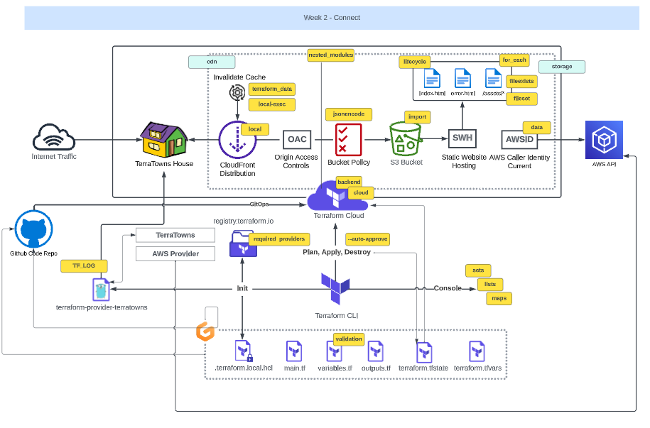

# 
Terraform Beginner Bootcamp 2023 Week 2

## Week 2 Objectives.
The objectives of week 2 where:
- Clone a [Sinatra](https://en.wikipedia.org/wiki/Sinatra_%28software%29) web server.
- Clone bash scripts used for CRUD.
- Update Gitpod environment to automatically run the Terratowns Mock Server.

  

# 
Week 2 Architecture Diagram 

# Table of Contents

- [Sinartra](#sinatra)
- [Gitpod environment](#gitpod-environment)

## Sinatra 
[Sinatra](https://sinatrarb.com/documentation.html) is a free and open source micro server framework written in Ruby.

We have been provided with the code for this server. It will act as a mock server.

We cloned the code from into this repository along with the Bash scripts for [Create Read Update Delete](https://en.wikipedia.org/wiki/Create,_read,_update_and_delete) (CRUD)

## Gitpod environment
We updated the gitpod.yml file to automatically start the server when a Gitpod workspace is launched.